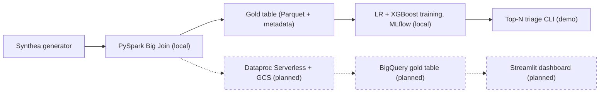

# synthea-readmission-risk

[](https://github.com/fma00/synthea-readmission-risk/actions/workflows/ci.yml) [](LICENSE) [](.python-version)

An end-to-end, tested pipeline for predicting **unplanned** 30-day hospital readmission from [Synthea](https://synthea.mitre.org/)-generated synthetic patient data. A PySpark "Big Join" builds a per-encounter feature table and an explicit planned-versus-unplanned readmission label; a leakage-controlled training pipeline — chronological, patient-disjoint split with a censoring buffer and a label-window purge — fits a logistic regression baseline and a calibrated XGBoost challenger, both tracked in MLflow; and a Top-N triage CLI ranks held-out discharges behind a set of provenance guards that refuse any model/data mismatch.

The headline model result is a negative one, and is reported as such: on the development-set test window (not a virgin holdout) logistic regression reaches ROC-AUC 0.869, statistically indistinguishable from a reason-code-only baseline that uses no patient features at all (a per-admission-reason rate table fitted on the training rows; 0.873), so the models add little on this small, synthetic sample. The pipeline, the leakage controls and the evaluation discipline are what this repo is for; the model number is a finding, not a headline.

> [!NOTE]
> **Work in progress.**
>
> - **Built:** local pipeline, models and demo scorer, unit-tested.
> - **Not built yet:** cloud (GCP / BigQuery), scale-up and dashboard — see the [Roadmap](#roadmap).
> - **Limits:** synthetic data, small sample, development-set numbers — see [Limitations](#limitations).
> - **Read next:** [Status](#status) · [Results so far](#results-so-far) · [Limitations](#limitations) · [Roadmap](#roadmap)

## Status

| Slice | Stage | Status |
|---|---|---|
| 1 | [Local Synthea generation](notes/eg-new-feature/local-synthea-generation-2026-09-16.md) | Done |
| 2 | [PySpark Big Join feature engineering](notes/eg-new-feature/pyspark-big-join-2026-09-19.md) | Done |
| 2b | [Unplanned-readmission label and gold-table provenance](notes/eg-new-feature/readmission-label-planned-exclusion-2026-09-20.md) | Done |
| 3 | [Logistic regression and calibrated XGBoost, tracked in MLflow](notes/eg-new-feature/model-training-2026-09-19.md) ([results](docs/results.md)) | Done |
| 4 | [Top-N triage CLI (a demo over held-out rows)](notes/eg-new-feature/batch-scoring-cli-2026-09-20.md) ([usage](docs/scoring.md)) | Done |
| next | **Cloud**: GCS, Dataproc Serverless, BigQuery gold table | Planned (not started) |
| next | **Scale-up**: 100k-200k patients with a fresh seed | Planned (not started) |
| next | **Dashboard**: Streamlit on BigQuery | Planned (not started) |

## Architecture

Full architecture rationale lives in [notes/prds/big-join-architecture-lock-in-2026-09-15.md](notes/prds/big-join-architecture-lock-in-2026-09-15.md); the standing architecture summary is in [CLAUDE.md](CLAUDE.md#architecture).



Solid boxes are built; dashed boxes are planned.

## Results so far

Measured on the 10,000-patient Synthea reference population with the unplanned-readmission label: 6,391 training rows (96 positives) and 1,539 held-out test rows (**41 positives**); 95% patient-clustered bootstrap intervals are in the full write-up.

| Model | ROC-AUC | Brier score | Expected calibration error |
|---|---|---|---|
| Logistic regression | 0.869 [0.820, 0.919] | 0.0255 [0.0184, 0.0340] | 0.013 [0.008, 0.023] |
| Calibrated XGBoost | 0.823 [0.751, 0.884] | 0.0257 [0.0181, 0.0347] | 0.018 [0.013, 0.029] |
| Reason-code-only lookup (reference, no model; `readmission_risk.models.baselines.reason_code_lookup`) | 0.873 | 0.0252 | 0.012 |

- **A reason-code-only baseline matches or beats both models.** The lookup (a per-admission-reason rate table, no patient features) scores 0.873 ROC-AUC; its paired differences with logistic regression include zero, and calibrated XGBoost is worse than the lookup.
- **The models barely beat the base rate.** Brier skill scores against the training prevalence are 0.022 (logistic regression) and 0.014 (XGBoost), and XGBoost is worse than logistic regression on ROC-AUC (paired −0.047 [−0.092, −0.010]).
- **Small sample.** 41 test positives is below the trainer's own 50-positive reliability threshold, so `train_models.py` prints an "unreliable" warning on this run by design, and the intervals are wide.
- **The positive rate shifts** between train and test (1.50% vs 2.66%), and both models under-predict on average.
- **Not a virgin holdout.** The cutoff date, the features and the label rule were chosen while looking at this test window, so read these as development-set numbers; the untouched validation is the planned larger population.
- **More data mainly buys precision.** With the larger population an ROC-AUC of about 0.87–0.90 is *expected*, consistent with Synthea generating these events from scripted pathways (a projection, not a measurement).

Full tables, paired intervals, how the label was built and the remaining caveats: [docs/results.md](docs/results.md).

## Limitations

- Synthetic data, not clinical evidence — see [About the data](#about-the-data).
- Weak, small-sample result: 41 test positives and wide intervals — [details](docs/results.md).
- Not a virgin holdout: design choices were made while looking at the test window — [details](docs/results.md).
- A thin leakage margin of about 6 days between the label window and the test start — [details](docs/results.md).
- The label is still reason-concentrated (one admission reason dominates the test positives) — [details](docs/results.md).
- The scorer is a demo over held-out rows, not as-of scoring of new discharges — [details](docs/scoring.md).
- Local only: no cloud deployment yet — see the [Roadmap](#roadmap).
- One seed, one population, one label definition — see the [Roadmap](#roadmap).

## About the data

**Data-realism note:** Synthea is a synthetic patient generator, not real-world data. Notable limitations relevant to this project: it codes conditions in SNOMED-CT rather than ICD-10-CM, its disease modules are largely isolated from one another (limited comorbidity interaction), coverage is concentrated in a few dozen well-modeled conditions, it does not model hospital resource capacity, and it lacks the messiness (missing values, coding errors, inconsistent documentation) of real clinical data. Treat model performance here as a demonstration of the pipeline and methodology, not a clinically validated result.

## Roadmap

Ordered by intent, not by date, and in dependency order: the larger run (item 2) targets the cloud setup of item 1 (Dataproc Serverless on GCS), and the billing alert comes first. For scale: the Big Join reads about a third of the raw export (2.3 GB of 7.5 GB per 10,000 patients), so roughly 23-46 GB at 100k-200k patients (arithmetic, not a measurement).

1. **Cloud (not started):** the enabling infrastructure: a ~$20/month billing alert first, then Dataproc Serverless on GCS and the BigQuery gold table via the direct write method (Storage Write API).
2. **Scale-up (not started):** 100k-200k patients, run on the cloud setup of item 1, with a NEW seed and fresh `reference_date` as the untouched validation, sized for power (about 1,000-2,000 train / 400-800 test positives; arithmetic, not a measurement); the same PySpark job with only the config-driven base path changed. This raises the architecture PRD's original 50k-100k figure so the test window holds enough positives (see [docs/results.md](docs/results.md)).
3. **Dashboard (not started):** a Streamlit dashboard reading BigQuery (Streamlit Community Cloud first, Cloud Run later).
4. **Smaller follow-ups:** label v2 after scale-up, as-of scoring, hyperparameter tuning, feature attribution, hosted MLflow, Airflow, dbt once there is more than one BigQuery table.

## What this shows

| Role | What the repo shows | Where |
|---|---|---|
| Data engineering | Schema-first PySpark join (hand-declared `StructType`, no `inferSchema`), planned-stay and continuation logic, gold-table provenance metadata, hash-pinned lockfiles, CI | [big_join.py](src/readmission_risk/pipeline/big_join.py), [schemas.py](src/readmission_risk/pipeline/schemas.py), [gold_metadata.py](src/readmission_risk/pipeline/gold_metadata.py), [requirements.txt](requirements.txt), [ci.yml](.github/workflows/ci.yml) |
| Data science | Chronological, patient-disjoint split with a censoring buffer and a label-window purge; label-definition work; calibration metrics; clustered-bootstrap intervals; a no-model baseline; an honest weak result | [split.py](src/readmission_risk/models/split.py), [evaluate.py](src/readmission_risk/models/evaluate.py), [baselines.py](src/readmission_risk/models/baselines.py), [results](docs/results.md) |
| ML engineering | MLflow tracking; guard-checked model loading (13 guards); idempotent, partitioned batch scoring with an injectable writer | [tracking.py](src/readmission_risk/models/tracking.py), [runs.py](src/readmission_risk/scoring/runs.py), [pipeline.py](src/readmission_risk/scoring/pipeline.py), [score_discharges.py](scripts/score_discharges.py) |

## Quick start

```sh
python3.12 -m venv .venv
source .venv/bin/activate
pip install -e .
pip install --require-hashes -r requirements.txt -r requirements-linux-extras.txt
pip install --require-hashes -r requirements-dev.txt
ruff check . && pytest
```

Needs a JDK 17+ on `PATH` (PySpark local mode) and, on macOS, `brew install libomp` (XGBoost). The tests need no downloaded data. The full pipeline (Synthea generation, Big Join, training, scoring) is in [docs/setup.md](docs/setup.md) and [docs/scoring.md](docs/scoring.md).

## How this was built

Developed with Claude Code (Anthropic's coding agent) under a design-first workflow inspired by [Elephants, Goldfish, and the New Golden Age of Software Engineering](https://drensin.medium.com/elephants-goldfish-and-the-new-golden-age-of-software-engineering-c33641a48874). Claude drafted the code, tests and documents; the project owner set the goals and made the decisions recorded in `notes/`. Designs and diffs went through independent fresh-context reviewer passes; where a pass did not close, the notes say so and record the owner's decision to proceed. Commits carry a `Co-Authored-By` trailer.

The workflow lives in [.claude/commands/](.claude/commands/) and [CLAUDE.md](CLAUDE.md). Four notes show the trail: the [architecture PRD](notes/prds/big-join-architecture-lock-in-2026-09-15.md), the [model-training design](notes/eg-new-feature/model-training-2026-09-19.md), the [label design](notes/eg-new-feature/readmission-label-planned-exclusion-2026-09-20.md) and the [batch-scoring design](notes/eg-new-feature/batch-scoring-cli-2026-09-20.md).

Commands to regenerate the data and re-derive the reported numbers are given in [docs/setup.md](docs/setup.md), [docs/results.md](docs/results.md) and the [measurements note](notes/eg-new-feature/readmission-label-planned-exclusion-2026-09-20-measurements.md); a bit-exact regeneration from the same seed has not been verified, and the MLflow store is local and not published. Notes are dated historical records and may cite the README as it was at the time.

## Repository layout

```
src/readmission_risk/pipeline/  # Synthea generation wrapper, PySpark Big Join, gold-table metadata
src/readmission_risk/models/    # split, features, training, evaluation, MLflow tracking
src/readmission_risk/scoring/   # Top-N triage scorer (pure functions)
scripts/                        # command-line entry points
tests/                          # pytest suite (tests/test_docs.py covers these docs)
docs/                           # setup, results and scoring write-ups
notes/                          # design docs, PRDs, measurements (dated records)
.claude/commands/               # the /eg-* design-review workflow
.github/workflows/              # CI: ruff + pytest
```

## License and acknowledgements

MIT, see [LICENSE](LICENSE). [Synthea](https://synthea.mitre.org/) (MITRE, Apache-2.0) is downloaded by [scripts/setup_synthea.sh](scripts/setup_synthea.sh) and is not redistributed.
